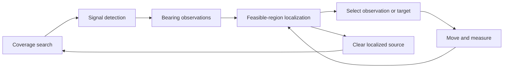
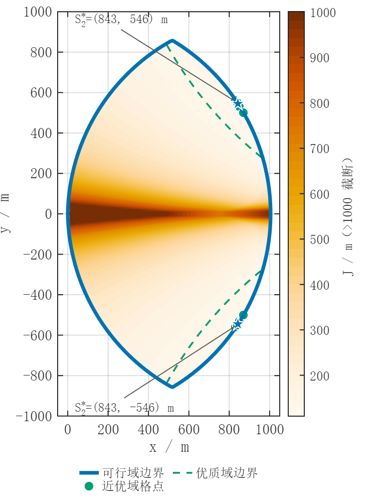

# Robot-Based Interference Source Localization

A mathematical modeling competition project about finding and clearing interference sources with a mobile robot when bearing measurements have bounded error. The team combined geometric localization, observation-point optimization and coverage planning in Python simulations, with MATLAB scripts for visualization.

Bearing observations define a feasible source region through half-plane constraints. Its diameter and enclosing circle help assess localization, while an observation objective selects positions that reduce worst-case uncertainty. Coverage planners search for multiple sources and schedule movement, measurements and clearance in synthetic worlds. The repository includes archived geometry results, fixed-seed offline run tables and the scripts needed to reproduce selected experiments. All team members worked across modeling, implementation and analysis; no Q1–Q4 module is assigned exclusive individual ownership.
## Methods

- Half-plane intersection to construct the region consistent with noisy bearings.
- Feasible-region diameter and minimum enclosing circle calculations.
- Observation-point selection using a worst-case posterior-diameter objective.
- Spiral and waypoint coverage strategies for multi-source search and clearance.
- Directional-source coverage checks and fixed-seed offline experiments.

## How the simulation works

The robot searches for signals, collects bearing observations, and narrows the feasible source region. It then chooses another observation position or a target to clear. The offline simulator accounts for travel, measurement, target switching and clearance time; Q1 and Q2 also run as separate geometry and optimization studies.



## Results



The figure shows Q2's worst-case posterior diameter over reception-feasible observation positions.

| Task | Recorded result |
| --- | --- |
| Q1 | Equilateral case: region diameter **30.230 m**, enclosing-circle radius **17.453 m** |
| Q2 | Archived center configuration: worst-case diameter **129.741 to 110.969 m**, a **14.47%** reduction |
| Q3 | Waypoint planner B cleared **384/384 sources** over 30 offline runs |
| Q4 | Planner B cleared **384/384 sources** over 30 offline runs, with directional-source probability 0.4 |

Q3/Q4 use seeds 1000–1029 and different source models. These are later synthetic validation runs, not physical robot measurements or recovered competition scores. The Q3 spiral baseline's **383/384** result is retained as well. Q2 measures posterior-region diameter, not position error or a proven global optimum.

Additional figures show [Q1 localization](figures/q1_localization_geometry.png), [Q2 observation geometry](figures/q2_observation_geometry.png), [Q2 sensitivity](figures/q2_sensitivity.png), [Q3 coverage geometry](figures/q3_coverage_geometry.png) and [Q4 directional coverage](figures/q4_directional_coverage.png). The coverage figures illustrate geometry rather than recorded robot trajectories; Q4's 173.545-degree worst angular gap is a sampled diagnostic.

## Getting started

From the repository root:

```bash
python -m pip install -r requirements.txt
python src/q1_localization_verification.py
python src/run_simulation_experiments.py --task q3 --planner B --runs 5 --seed0 1000
python src/run_simulation_experiments.py --task q4 --planner B --runs 5 --seed0 1000 --directional-ratio 0.4
```

The earlier executed checks used Python 3.12.14. New experiment outputs go to `results/generated/`, leaving the checked-in snapshots unchanged. MATLAB is optional for Python experiments. Dependencies include NumPy and SciPy; the optional Q4 figure renderer uses ReportLab and Poppler.

## Project layout and testing

| Directory | Contents |
| --- | --- |
| `src/` | Models, geometry checks and simulation drivers |
| `matlab/` | Task-specific plotting scripts and helpers |
| `data/` | Q1 validation inputs |
| `figures/` | Six selected visualizations |
| `results/reference/` | Archived Q1/Q2 results |
| `results/reproduced/` | Later numerical checks and offline run tables |

The existing checks compare Q1 geometry with archived cases and Q2 objective calculations with independent geometry and saved values. [Reproduction instructions](docs/REPRODUCIBILITY.md) include the 30-run commands, metric definitions and tested environments. Earlier validation did not execute the SciPy-based Q1 main entry point, full Q2 regeneration, MATLAB rendering or the external contest simulator. This documentation cleanup does not claim those checks were completed.

## Team Collaboration

This project was completed collaboratively for a mathematical modeling competition. Our team worked together on mathematical modeling, implementation, debugging, experiments, and result analysis rather than dividing the project into strictly separate modules. The repository presents our team's combined work.

[Source and result notes](docs/PROVENANCE.md) distinguish archived outputs from later validation and describe figure sources.

## Limitations

Results describe numerical models and synthetic worlds. Sampled optimization and coverage checks do not prove continuous-domain global guarantees. External simulator interoperability and physical robot operation remain unverified.
